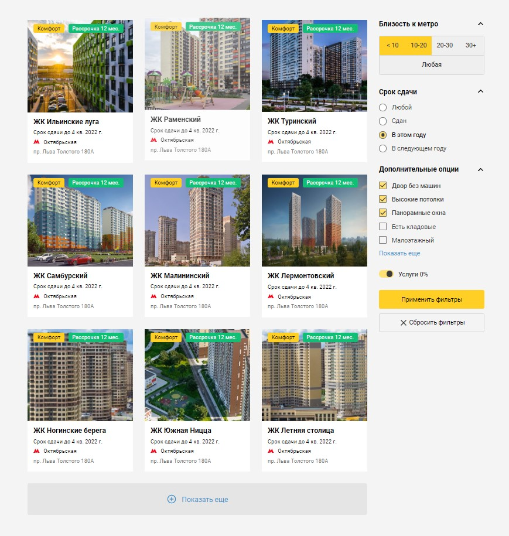

# real-estate

<h3>Верстка по макету из Figma: страница сайта недвижимости с карточками объектов (жилые комплексы) и фильтрами выбора.</h3>

Реализовано с использованием HTML, CSS и JS(native).

<h3>Overview</h3>

<h4>При расстановке элементов на странице применены/использованы:</h4>
<pre>
- метатеги и семантические теги <code>&lt;main>&lt;/main>, &lt;aside>&lt;/aside></code> HTML;
- обнуляющие стили CSS;
- технология flexbox CSS;
- пседвоэлементы и псевдоклассы CSS;
- абсолютное позиционирование CSS;
- transform и transition CSS.
</pre>

<h4>Реализовано на JavaScript:</h4>
<pre>
- Блок с карточками. При нажатии на кнопку "Показать еще" на странице появляются еще 3 карточки. Название кнопки изменяется на "Скрыть";
- Скрытие/показ виджетов (фильтров) в боковом меню по нажатию на Тайтл или стрелку соответствующего виджета (фильтра);
- Фильтр в боковом меню "Близость к метро". При нажатии кнопки "Любая" снимается выбор с остальных кнопок виджета "Близость к метро";
- Фильтр в боковом меню "Дополнительные опции". При нажатии на кнопку "Показать еще" в этом виджете появляются еще 3 доп. опции. Название кнопки изменяется на "Скрыть".
</pre>
